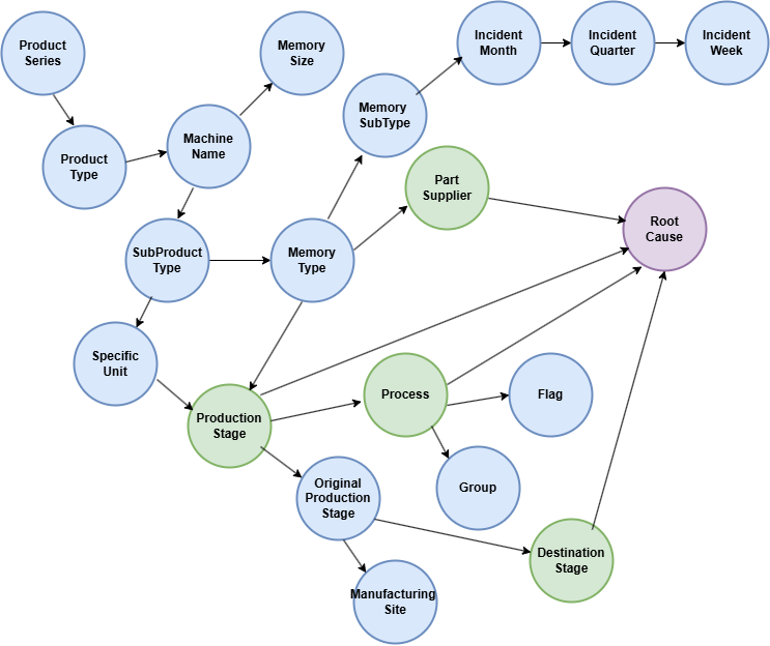
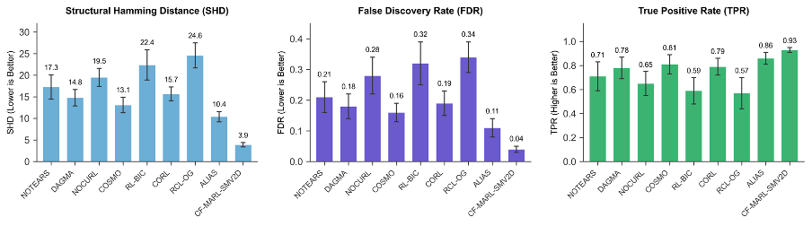
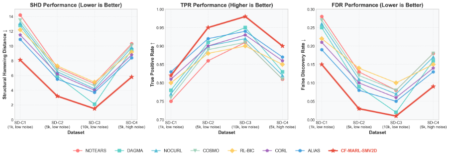

# CF-MARL-SMV2D: Counterfactual Multi-Agent Reinforcement Learning with Soft-Masked Vec2DAG

This is the offciial Implementation of the CF-MARL-SMV2D algorithm which is a novel causal discovery framework that combines collaborative multi-agent reinforcement learning with domain-informed soft masks and counterfactual reasoning to identify robust defect root causes in complex manufacturing environments.

## Abstract
Effective defect management is critical for maintaining product quality in today’s manufacturing environments. However, traditional analysis often relies on correlational models that fail to capture the underlying complexity of defect causation. To address this challenge, we introduce a novel framework, Counterfactual Multi-Agent Reinforcement Learning with Soft-Masked Vector to DAG (CF-MARL-SMV2D). The proposed framework features a collaborative multi-agent policy that explores the causal Directed Acyclic Graph (DAG) space. The framework integrates a learnable domain-informed soft mask to encode expert knowledge and a counterfactual-based reward function to ensure robust causal identification. The framework was validated using a case study from a leading computer server manufacturer. Empirical results demonstrate that the proposed approach outperforms state-of-the-art causal discovery algorithms, achieving Structural Hamming Distance of 3.9 and low False Discovery Rate. Further, the resulting causal feature set enables superior downstream root cause identification with a predictive accuracy of 0.961.

## Key Features

- **Multi-Agent Architecture**: Leverages multiple RL agents for robust causal discovery
- **Soft-Masked Vec2DAG**: Advanced differentiable DAG learning with domain constraints
- **Counterfactual Analysis**: Integrated counterfactual reasoning for causal validation
- **Domain-Aware Constraints**: Incorporates manufacturing domain knowledge
- **Scalable Implementation**: Optimized for large-scale industrial datasets

## Key Results
Our framework, CF-MARL-SMV2D, was validated on a real-world dataset from a leading computer server manufacturer. The results demonstrate that the proposed multi-agent reinforcement learning approach successfully recovers robust causal structures and outperforms state-of-the-art baselines in both accuracy and interpretability.

                   Figure 4: Final Consensus causal DAG
 
The proposed CF-MARL-SMV2D framework achieved a Structural Hamming Distance (SHD) of 3.9, significantly outperforming the state-of-the-art ALIAS method (SHD 10.4) and continuous optimization baselines. As shown in Figure 7, the model also secured the lowest False Discovery Rate (0.04) and the highest True Positive Rate (0.93) among all tested algorithms.

                 Figure 7: Causal discovery performance of state-of-the-art algorithms on the DIMM defects dataset 

Even on synthetic datasets, CF-MARL-SMV2D consistently achieves superior performance across all data conditions. The algorithm demonstrates particularly strong scalability with sample size, achieving an exceptional SHD of 1.5 in the large data regime (SD-C3) compared to 2.1 for the next best method (i.e., DAGMA).

                 Figure 8: Causal Discovery Performance on Synthetic Datasets 


## Installation

### Prerequisites
- Python 3.8+
- CUDA 11.0+ (optional, for GPU acceleration)

### Install from source
```bash
git clone https://github.com/yourusername/cf-marl-smv2d.git
cd cf-marl-smv2d
pip install -e .
```

### Install dependencies only
```bash
pip install -r requirements.txt
```

## Quick Start

### Basic Training
```bash
python train.py --data your_data.xlsx --timesteps 500000 --agents 3
```

### Advanced Configuration
```bash
python train.py --data your_data.xlsx --config configs/custom_config.yaml
```

## Usage

### Python API
```python
from cf_marl_smv2d.train import CFMARLTrainer
from cf_marl_smv2d.configs.training_config import TrainingConfig

# Create configuration
config = TrainingConfig(
    total_timesteps=500000,
    num_agents=3,
    environment=EnvironmentConfig(alpha=0.02, beta=10.0)
)

# Initialize trainer
trainer = CFMARLTrainer(config)
trainer.load_data("your_data.xlsx")
trainer.initialize_components()

# Train model
results = trainer.train()
```

### Configuration Management

Create a YAML configuration file:
```yaml
total_timesteps: 500000
num_agents: 3
eval_interval: 25000

ppo:
  learning_rate: 0.0003
  n_steps: 2048
  batch_size: 256

environment:
  alpha: 0.02
  beta: 10.0
  tau: 0.5

counterfactual:
  max_samples: 1000
  use_cache: true
```

## Architecture

### Core Modules
- `core/`: Data preprocessing and domain constraint management
- `models/`: Neural network architectures including learnable mask networks
- `algorithms/`: Core algorithms (Vec2DAG, SEM estimation, counterfactual analysis)
- `environments/`: Gymnasium-compatible RL environments
- `configs/`: Configuration management system
- `utils/`: Visualization and logging utilities


```

## Citation

If you use this code in your research, please cite:
```bibtex
@article{cfmarl2024,
  title={Counterfactual Multi-Agent Reinforcement Learning for Causal Defect Analysis in Manufacturing Environments},
  author={Sudhanshu Srivastava, Faisal Aqlan, Pratik J. Parikh, Md Noor-E-Alam},
  journal={NA},
  year={2026}
}
```

## License

MIT License - see LICENSE file for details.

## Contributing

Contributions are welcome! Please read CONTRIBUTING.md for guidelines.

## Support

For issues and questions, please open a GitHub issue or contact the maintainers.